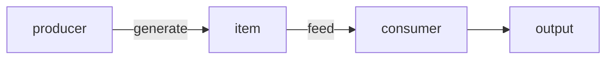

# Filter

## 原文

Use a sender filter like this:

If you have an offer, opportunity, or introduction that might make my life more interesting, e-mail me at interesting *calnewport.com*. For the reason stated above, I'll only respond to those proposals that are a good match for my schedule and interest.

---

## 分析

直接进行实践方法论的分析

先约定三个概念， `consumer`, `producer`, `item` 也就是消费者和生产者 以及物品

`producer` 生产 `item`, 之后 `consumer` 投入资源消耗 `item`, 这是一个最简的运作方式

这里的 `filter` 特指使用偏向机械和自动化的方法对于 `producer` 产生的item 进行一些成本较低的处理， 进而可以减少 item 的数量或者让 item 更加有序， 降低总体的资源消耗成本 或者提高最终的产出

要使用 filter 的思维来对现有的选项进行过滤， 需要包含以下的步骤

- 核心特征分析

分析当前的核心诉求，也就是 `consumer` 所需要的最终产出的核心是什么

分析之后将这个核心诉求转化成可以用来描述 `item` 的特征

我们可以将这个特征看成一个函数 $y = f(x)$ 且 $y \in \{0, 1\}$

也就是说它只回答是或否的问题

> 这里提到的函数, 跟线性代数当中的一元谓词有相同之处

由所有的候选函数组成一个 `filter`

- 信息压缩

我们得到候选的 $n$ 个核心特征之后， 直接将候选的 `item` 放到这个 `filter` 当中，经过运算之后我们将会得到一个 $n$ 维的向量， 这个时候就根据选择的需要进行复合的逻辑运算即可。

我们最终会得到这个 `item` 是否应该进一步交给 `consumer` 的结论。

- 分类和整理

因为我们在第二步的时候得到了每一个 `item` 的 $n$ 维特征， 所以可以直接根据这些特征对于不同类型的 `item` 进行进一步的分类。 可以直接参考例子 [核心启发内容](../essential.md)
