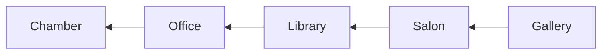

# 启发点记录

## Filter

> Filter 说明了什么样的内容会被放进来， 防止整个摘要的大部分内容都被重复抄一遍
> 我靠， 我发现写个 filter 都需要先想一步: 读这本书的核心目的到底是什么

> [!NOTE]
> 核心目的
> 学到全新的思维方式和实践方法
> 扩展认知边界， 做出全新的生活方式调整

1. 可以被抽象成更加通用的模式并且运用在各种事情上的 (比如说 `filter` 模型)
2. 之前很少看到的观点和思路 (比如说一些极端的做法)
3. 可以直接进行实践的建议的方法
4. 愿意进行进一步的研究和阐述
5. 本身非常有趣

每条记录后面都必须说明满足哪个 filter

## Record

### Eudaimonia Machine (5)

There is a post about `Eudaimonia Machine` which is described on Deep Work. It's interesting.

It's structure

See also: [The Eudaimonia Machine- An Office Space Concept for the 21st Century?](https://blog.fentress.com/blog/the-eudaimonia-machine-a-space-concept-for-the-21st-century)

### Ritualize (4)

- Where you'll work and for how long
- How you'll work once you start to work (structure your work with specific structure or rules)
> This is interesting, the process itself specify what you can do and what you should not do so that you can just focus on the deep work itself, not several decisions.
- How you'll support your work
> the suggestions are all vague. And we should know what actually we need for deep work.

### 4 Discipline of Execution (3, 4)

- Discipline 1: Focus on the Wild Important

You should identify a small number of ambitious outcomes to pursue with your deep work hours.
Have a specific goal that would return tangible and substantial professional benefits will generated a steadier stream of ethusiasm.

- Discipline 2: Act on the Lead Measures

Lag measures describe the thing you're ultimately trying to improve.

Lead measures, on the other hand, measure the new behaviors that will drive success on the lag measures.

> The atomic habit emphasize this: Pattern > Output

### Zeigarnik Effect (3, 4, 5)

This effect describe the ability of incomplete tasks to dominate our attention. It tell us that if you simply stop whatever you are doing at five p.m. and declare, "I'm done with work until tomorrow," you'll likely struggle to keep your mind clear of professional issues, as the many obligations left unresolved in your mind will keep battling for your attention throughout the evening.

The advise on book is simple, write it down then maybe make a rough plan for this task.

### Embrace Bordom (4)

So we have scales that allow us to divide people into people who multitask all the time and people who rarely do, and the differences are remarkable. People who multitask all the time can't filter out irrelevancy. They can't manage a working memory. They're chronically distracted. They initiate much larger parts of their brain that are irrelevant to the task at hand...they're pretty much mental wrecks.

### Internet Schedule (3, 4)

I propose an alternative to the Internet Sabbath. Instead of scheduling the occasional break from distraction so you can focus, you should instead schedule the occasional break from focus to give in the distraction.

Schedule in advnce when you'll use the Internet, and then avoid it altogether outside these times.

- Point 1
This strategy works even if your job requires lots of Internet use and/or prompt e-mail replies.

- Point 2
Regardless of how you schedule your Internet blocks, you must keep the time outside these blocks absolutely free from Internet use.

### Any-Benefit mindset (1, 2)

**The Any-Benefit Approach to Network Tool Selection**

You're justified in using a network tool if you can identify any possible benefit to its use, or anything you might possibly miss out on if you won't use it.

The problem with this approach, of course, is that it ignore all the negtives that come along with the tool in question. These services are engineered to be addictive--robbing time and attention from activities that more directly support your professional and personal goals.

**The Craftsman Approach to Tool Selection**

Identify the core factor that determine your success and happiness in your professional and personal life. Adopt a tool only if its positive impact on these factors substantially outweigh its negative impacts.

### Schedule Every Minute of Your Day (2, 3, 4)

You spend much of your day on autopilot.

Here's my suggestion: At the beginning of each workday, turn to a new page of lined paper in a notebook you dedicate to this purpose. Down the left-hand side of the page, mark every other line with an hour of the day, covering the full set of hours you typically work. Now comes the important part: Divide the hours of your workday into blocks and assign activities to the blocks. For example, you might block off nine a.m. to eleven a.m. for writing a client's press release. To do so, actually draw a box that covers the lines corresponding to these hours, then write "press release" inside the box. Not every block need be dedicated to a work task. There may time blocks for lunch or relaxation breaks. To keep things reasonably clean, the minimum length of a block should be thirty minutes.

**When you're done scheduling your day, every minute should be part of a block. You have, in effect, given minute of your workday a job.**

To summarize, the motivation for this strategy is the recognition that a deep work habit requires you to treat your time with respect.
