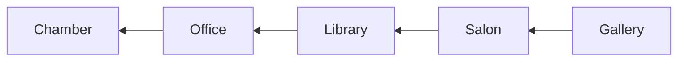

# Original Content of Deep Work

## Definition

**Deep Work**: Professional activities performed in a state of distraction-free concentration that push your cognitive capabilities to their limit. These efforts create new value, improve your skill, and are hard to replicate.

**Shallow Work**: Noncognitively demanding, logistical-style tasks, often performed while distracted. These efforts tend to not create much new value in the world and are easy to replicate.

---

## The Deep Work Hypothesis

The ability to perform deep work is becoming increasingly rare at exactly the same time it is becoming increasingly valuable in our econonmiy.

As a sequence, the few who cultivate this skill, and then make it the core of their working life, will thrive.

This book has two goals, pursued in two parts.

The first, tackled in Part 1, is to **convince you that deep work hypothesis is true**.

The second, tackled in Part 2, is to **teach you how to take advantage habits to place deep work at the core of your professional life.**

---

## Part 1

### Deep Work Is Valuable

Let's pull together the threads spun so far: Current economic thinking, as I've surveyed, argues that the unprecedented growth and impact of technology are creating a massive restructring of our economy, three groups will have a particular advantage: those who can work well and creatively with intelligent machines, those who are the best at what they do, and those with access to capital.

***Two Core Ability for Thriving in New Economy***

1. The ability to **quickly master hard things**.

2. The ability to produce at an elite level, in terms of both **quality and speed**.

**The two core abilities just described depend on our ability to perform deep work.**

***Deep Work Helps You Quickly Learn Hard Things***

Antonin-Dalmace Sertillanges

> Let your mind become a lens, thanks to the converging rays of attention; let your soul be all intent on whatever it is that is established in your mind as a dominant, wholly absorbing idea.

Ericsson

> We deny that these differences [between expert performaners and normal adults] are immutable... Instead, we grgue that the differences between expert performers and normal adults reflect a life-long period of deliberate effort to improve performance in a specific domain.

This brings us to question of what deliberate practice actually requires. Its core components are usually identified as follows:

1. You attention is **focused** tightly on a specific skill you're trying to improve or an idea you're trying to master.

2. You receive **feedback** so you can correct your approach to keep your attention exactly where it's most productive.

By focusing intensely on a specific skill, you're forcing the specific relevant circuit to fire, again and again, in isolation. This repetitive use of a specific circuit triggers cells called oligodendrocytes to begin wrapping layers of myelin around the neurons in the circuits--effectvely cementing the skill.

The reason, therefore, why it's important to focus intensely on the task at hand while avoiding distraction is **because this is the only way to isolate the relevant neural circuit enough to trigger useful myelination.**

***Deep Work Helps You Produce at an Elite Level***

$P = T \times I$

Where

- $P$ is HIgh-Quality Work Produced

- $T$ is Time Spent

- $I$ is Intensity of Focus

The probloem this research identifies with this work strategy is that when you switch from some Task A to another Task B, your attention doesn't immediately follow--a *residue* of your attention remains stuck thinking about the original task. This residue gets especially thick if your work on Task a was unbounded and of low intensity before you switched, but even if your finish Task A before moving on, your attention remains divided for a while.

Leroy

> People experiencing attention residue after switching tasks are likely to demonstrate poor performance on the that next task, and the more intense the residue, the worse the performance.

To produce at your peak level you need to work for extended periods with full concentration on a single task free from distraction. Put another way, **the type of work that optimizes your performance is deep work.**

**Exception**

They(High-level executive) are then presented inpus throughout the day--in the form of e-mails, meetings, site visits, and the like--that they must process and act on. To ask a CEO to spend four hours thinking deeply about a single problem is a waste of what makes him or her valuable. It's better to hire three smart subordinates to think deeply about the problem and then bring their solutions to executive for a final decision.

This specificity is important because it tells use theat if you're a high-level executive at a major company, you probably don't need the advice in the pages that follow.

There are, we must continually remember, certain corners of our economy where depth is no valued.

Similarly, several managers I know tried to convince me that they're most valuable when they're able to respond quickly to their team's problems, preventing project logjams. *They see their role as enabling other's productivity, not necessarily protecting their own.*

### Deep Work Is Rare

To summarize, big trends in business today actively decrease people's ability to perform deep work, even thought the benefits promised by these trends (e.g., increased serendipity, faster responses to requests, and more exposure) are arguably dwarfed by the benefits that flow from a commitment to deep work(e.g, the ability to learn hard things fast and produce at an elite level).

My objective is to convince you that although our current embrace of distraction is a real phenomenon, it's built on an unstable foundation and can be easily dismissed once you decide to cultivate a deep work ethic.

***The Metric Black Hole***

We should not, therefore, expect the bottom-line impact of depth-destroying behaviors to be easily detected. As Tom Cochran discovered, such metrics fall into an opaque region resistant to easy measturement--a region I call the *metric black hole*.

***The Principle of Least Resistance***

In a business setting, without clear feedback on the impact of various behaviours to the bottom line, we will tend toward behaviors that are easiest in the moment.

The principle of Least Resistance, protected from scrutiny by the metric black hole, supports work cultures that save us from the short-term discomfort of concentration and planning, at the expense of long-term satisfaction and the production of real value. By doing so, this principle drives us toward shallow work in an economy that increasingly rewards depth.

***Busyness as a Proxy for Productivity***

In the absence of clear indicators of what it means to be productive and valuable in their jobs, many knowledge workders turn back toward an industrial indicator of productivity: doing lots of stuff in a visible manner.

***The Cult of the Internet***

Deep work is at a servere disadvantage in a technopoly because it builds on values like quality, craftsmanship, and mastry that are decidedly old-fashioned and nontechnological. Even worse, to support deep work often requires the rejection of much of what is new and high-tech.

### Deep Work Is Meaningful

Our brains instead construct our worldview based on what we pay attention to. If you focus on a cancer diagnosis, you and your life become unhappy and dark, but if you focus instead on an evening martini, you and your life become more pleasant--even though the circumstances in both scenarios are the same. As Gallagher summarizes: "Who you are, what you think, feel, and do, what you love--is the sum of what you focus on."

论证大多引用轶事而不是构建完整的体系， 内容有点多， 所以这里不继续摘抄了。 直接进入 *Rule* 部分

---

## Rule #1

## Work Deeply

There is a post about `Eudaimonia Machine` which is described on Deep Work. It's interesting.

It's structure

See also: [The Eudaimonia Machine- An Office Space Concept for the 21st Century?](https://blog.fentress.com/blog/the-eudaimonia-machine-a-space-concept-for-the-21st-century)

Put another way, once you accept that deep work is valuable, isn't it enough to just start doing more of it ? Do we really need something as complicated as the Eudaimonia Machine (or its equivalent) for something as simple as remembering to concentrate more ofen?

Unfortunately, when it comes to replacing distraction with focus, matters are not so simple. To understand why this is true let's take a closer look at one of the main obstacles to going deep: *the urge to turn your attention toward something more superficial.*

A 2012 study found that **People fight desires all day long.** As Baumeister summarized in his subsequent book, *Willpower*: "Desire turned out to be the norm, not the exception."

The five most common desires these subjects fought include, not surprisingly, eating, sleeping, and sex. But the top five list also included desires for "taking a break from hard work... checking e-mail and social networking sites, surfing the web, listening to music, or watching television."

Baumeister

> You have a finite amount of willpoewr that becomes depleted as you use it.

**The key to developing a deep work habit is to move beyond good intentions and add routines and rituals to your working life designed to minimize the amount of your limited willpower necessary to transition into ad maintain a state of unbroken concentration.**

There are different philosophy to implement the Deep Work

- **Monastic Philosophy**

This philosophy attempts to maximize deep efforts by eliminating or radically minimizing shallow obligations. Practitioners of the monastic philosophy tend to have a well-defined and highly valued professional goal that they're pursuing, and the bulk of their professional success coms from doing this one thing exceptionally well.

- **Bimodal Philosophy**

This philosophy asks that you divide you time, dedicating some clearly defined stretches to deep pursuits and leaving the rest open to everything else. During the deep time, the bimodal workders will act monastically--seeking intense and uninterrupted concentration. During the shallow time, such focus is not prioritized. This division of time between deep and open can happen on multiple scales. For example, on the scale of week, you might dedicate a four-day weekend to depth and the rest to open time. Similarly, on the scale of a year, you might dedicate one season to contain most of your deep stretches.

- **Rhythmic Philosophy**

This philosophy argues that the easiest way to consistently start deep work session is to transform them into a simple regular habit. The goal, in other words, is to generate a rhythm for this work that removes the need for you to invest energy in deciding if and when you're going to go deep.

- **Journalistic Philosophy**

This name is a nod to the fact that jounrnalists, like Walter Isaacson, are trained to shift into a writing mode on a moment's notice, as is required by the deadline-driven nature of their profession.

---

***Ritualize***

To make the most out of your deep work sessions, build rituals of the same level of strictnesss and idiosyncrasy as the important thinkers mentioned previously.

There's no one correct deep work ritual--the right fit depends on both the person and the type of project pursued. But there are some general questions that any efficient ritual must address:

- **Where you'll work and for how long**

Your ritual needs to specify a location for your deep work efforts. This location can be as simple as your normal office with the door shut and dest cleaned off (a colleague of mine likes to put a hotel-style "do not distub" sign on his office door when he's tackling something difficult). If it's possible to identify a location userd *only* for depth--for instance, a conference room or quiet library--the positive effect ca be even greater.

- **How you'll work once you start to work**

Your ritual needs rules and processes to keep your efforts structured. For example, you might institute a ban on any Internet use, or maintain a metric such as words produced per twenty-minute internal to keep your concentration honed. Without this structure, you'll have to mentally litigate again and again what you should and should not be doing during there sessions and keep trying to assess whether you're working sufficiently hard. There are unnecessary drains on your willpower reserves.

- **How you'll support your work**

Your ritual needs to ensure your brain gets the support it needs to keep operating at a high level of depth. For example, the ritual might specify that you start with a cup of good coffee, or make sure you have access to enough fodd of the right type to maintain energy, or integrate light exercise such as walking to help keep the mind clear. This support might also include environmental factors, such as organizing the raw materials of your work to minimize energy-dissipating friction. To maximize your success, you need to support your effort to go deep. At the same time, this support needs to be systematized so that you don't waste mental energy figuring out what you need in the moment.

<mark>All these advise are so vague</mark>

---

***The Grand Gesture***

By leverageing a radical change to your normal environment, coupled perhaps with a **significant investment for efforts or money**, all dedicated toward supporting a deep work task, you increase the perceived importance of the task.

To put yourself in and exotic location to focus on a writing project, or to take a week off from work just to think, or to lock yourself in a hotel room until you complete an important invention: These gestures push your deep goal to a level of mental priority that helps unlock the needed mental resources.

***Execute Like a Business***

> 4 Disciplines of Execution
>
> abbreviated, 4DX

- **Discipline #1: Focus on the Wildly Important**

The more you try to do, the less you actually accommplish. For an individual focused on deep work, the implication is that you should **identify a small number of ambitious outcomes to pursue with your deep work hours**. The general exhortation to "spend more time working deeply" doesn't spark a lot of enthusiasm. To instead **have a specific goal that would return tangible and substantial professional benefits** will generate a steadier stream of enthusiasm.

- **Descipline #2: Act on the Lead Measures**

Once you've identified a wildly important goal, you need to measure your success. In 4DX, there are two types of metrics for this purpose: lag measures and lead measures. **Lag measures decribie the thing you're ultimately trying to improve.** The problem with lag measures is that they come too late to change your behavior: "When you receive them, the performance that drove them is already in the past."

Lead measures, on the other hand, **measure the new behaviors that will drive success on the lag measures.** Lead measures turn your attention to improving the behaviors you directly control in the near future that will then have a positive impact on your long-term goals.

- **Descipline #3: Keep a Compelling Scoreboard**

"People play differently when they're keeping score," the 4DX author explain.

- **Descipline #4: Create a Cadence of Accountability**

The 4DX authors elaborate that the final step to help maintain a focus on lead measures is to put in place "a rhythm of regular and frequent meetings of any team that owns a wildly important goal."

---

Kreider

> Idleness is not just vacatioin, an indulgence or a vice; it is as indispenable to the brain as vitamin D is to the body, and deprived of it we suffer a mental affliction as disfiguring as rickets... it is, paradoxically, necessary to getting any work done.

Instead, I want to suggest a more applicable but still quite powerful heuristic: At the end of the workday, shut down your consideration of work issues until the next morning--no after-dinner e-mail check, no mental replays of conversations, and no scheming about how you'll handle an upcoming challenge; shut down work thinking completely.

There are several reasons **Why** a shutdown will be profitable to your ability to produce valuable output.

- **Reason #1: Downtime Aids Insights**

The scientific literature has emphasized the benefits of conscious deliberation in decision making for hundreds of years... The question addressed here is whether this view is justified. We hypothesize that it is not.

To actively try to work through these decisions will lead to worse outcome than lading up the relevant information and the moving on to something else while letting the subconscious layer of your mind mull things over.

<mark>This has been proved by experiment, that's interesting.</mark>

The implication of this line of research is that providing your conscious brain time to rest enable your unconscious mind to take a shift sorting through your most complex professional challenges.

- **Reason #2: Downtime Helps Recharge the Energy**

Attention restoration theory (ART) claims that spending time in nature can improve your ability to concentrate.

To contentrate requires what ART called directed attention. This resource is finite: If you exhaust it, you'll struggle to contenctrate.

The 2008 study argues that walking on busy city streets requires you to use directed attention, as you must navigate complicated tasks like figuring out when to cross a street to not get run over, or when to maneuver around the slow group of tourists blocking the sidewalk. After just fifty minutes of this focus navigation, the subject's store of directed attention was low.

- **Reason #3: The Work That Evening Downtime Replaces Is Usually Not That Important**

... The implication of these results if that your capactiy for deep work in a given day is limited. If you're careful about your schedule, you should hit your daily deep work capacity during your workday. It follows, therefore, that by evening, you're beyond the point where you can continue to effectively work deeply.

<mark>But this is not necessarily proved that evening work is useless, the end point should depends on the body then feeling but not time</mark>

***Shutdown Ritual***

**Zeigarnik Effect**

This effect describes the ability of incomplete tasks to dominate our attention. It tell us that if you simply stop whatever you are doing at five p.m and declare, "I'm done with work until tomorrow," **you'll likely struggle to keep your mind clear of professional issues, as the many obligations left unresolved in your mind will, as in Bluma Zeigarnik's experiments, keep battling for your attention throughout the evening** (a battle that they'll often win).

The shutdown ritual described earlier leverages this tactic to battle the Zeigarnic effect. While it doesn't force you to explicitly identify a plan for every single task in your task list, it does force you to capture every task in a common list, and then review these tasks before making a plan for the next day. This ritual ensures that no task will be forgotten: Each will be reviewed daily and tackled when the time is appropriate. You mind, in other words, is released from its duty to keep track of these obligations at every moment--your shutdown ritual has taken over that responsibility.

---

## Rule #2

## Embrace Boredom

Clifford Nass

> So we have scales that allow us to divide people into people who multitask all the time and people who rarely do, and the differences are remarkable. People who multitask all the time can't filter out irrelevancy. They can't manage a working memory. They're chronically distracted. They initiate much larger parts of their brain that are irrelevant to the task at hand...they're pretty much mental wrecks.

Rule #1 taught you how to integrate deep work into your schedule and support it with routines and rituals designed to help you consistently reach the current limit of your contentration ability

Rule #2 will help you significantly improve this limit.

Two goals of rule #2: improving your ability to concentrate intensely and overcoming your desire for distraction.

***Don't Take Breaks from Distraction. Instead Take Breaks from Focus***

I propose an alternative to the Internet Sabbath. Instead of scheduling the occasional break from distraction so you can focus, you should instead schedule the occasional break from focus to give in to distraction.To make this suggestion more concrete, let's make the simplifying assumption that Internet use is synonymous with seeking distracting stimuli. Similarly, let's consider working in the absence of the Internet to be synnoymous with more focus work.

With these rough categorizations established, the strategy works as fllows: Schedule in advance when you'll use the Internet, and then avoid it altogether outside these times.

<mark>I think this suggestion is incredible as it inverse all mindest that focus is option to focus is default</mark>

While the basic idea behind this strategy is straightforward, putting it into practice can be tricky. To help you successd, here are three important points to consider.

- **Point #1** This strategy works even if your job requires lots of Internet use and/or prompt e-mail replies

- **Point #2** Regardless of how you schedule your Internet blocks, you must keep the time outside these blocks absolutely free from Internet use.

If this is infeasible--perhaps you need to get the current offline activity done promptly--then the correct response is to change your schedule so that your next Internet block begins sooner. The key in making this change, however, is to not schedule the next Internet block to occur immediately. Instead, enforce at least a five-minutes gap between the current moment and the next time you can go online.

- **Point #3** Scheduling Internet use at home as well as at work can further improve your concentration training.

As in the workplace variation of this strategy, if the Internet plays a large and important role in your evening entertainment, that's fine: Schedule lots of long Internet blocks. The key here isn't to avoid or even to reduce the total amount of time you spend engaging in distracting behavior, but is instead to give yourself plenty of opportunities throughout your evening to resist switching to these distraction at the slightest hint of boredom.

***Meditate Productively***

The goal of productive meditation is to take a period in which you're occupied physically but not mentally--walking, jogging, driving, showering--and focus your attention on a single well-defined professional problem. As in mindfulness meditation, you must continue to bring your attention back to the problem at hand when it wanders or stalls.

## Rule #3

## Quit Social Media

**The Any-Benefit Approach to Network Tool Selection**: You're justified in using a network tool if you can identify any possible benefit to its use, or anything you might possibly miss out on if you won't use it.

The problem with this approach, of course, is that it ignore all the negtives that come along with the tool in question. These services are engineered to be addictive--robbing time and attention from activities that more directly support your professional and personal goals.

**The Craftsman Approach to Tool Selection**: Identify the core factor that determine your success and happiness in your professional and personal life. Adopt a tool only if its positive impacts on these factors substantailly outweigh its negative impacts.

After thirty days of this self-imposed network isolatioin, ask yourself the following two questions about each of the servicces you temporarily quit:

1. Would the last thirty days have been notably better if I had been able to use this service ?

2. Did people care about that I wasn't using this service ?

***Don't User the Internet to Entertain Yourself***

Arnold Bennet identified the solution to this problem a hundred years earlier: *Put more thought into your leisure time.* In other words, this strategy suggest that when it comes to your relaxation, don't default to whatever catches your attention at the moment, but instead dedicate some advance thinkinig to the question of how you want to spend your "day within a day."

---

## Rule #4

## Drain the Shallows

37signal's experiments highlights an important reality: The shallow work that increasingly dominates the time and attention of knowledge workers is less vital than it often seems in the moment. For most business, if you eliminated significant amounts of this shallowness, their bottom line would likely remain unaffected.

***Schedule Every Minute of Your Day***

**You spend much of your day on autopilot**

Here's my suggestion: At the beginning of each workday, turn to a new page of lined paper in a notebook you dedicate to this purpose. Down the left-hand side of the page, mark every other line with an hour of the day, covering the full set of hours you typically work. Now comes the important part: Divide the hours of your workday into blocks and assign activities to the blocks. For example, you might block off nine a.m. to eleven a.m. for writing a client's press release. To do so, actually draw a box that covers the lines corresponding to these hours, then write "press release" inside the box. Not every block need be dedicated to a work task. There may time blocks for lunch or relaxation breaks. To keep things reasonably clean, the minimum length of a block should be thirty minutes.

**When you're done scheduling your day, every minute should be part of a block. You have, in effect, given minute of your workday a job.**

<mark>Maybe that's actually we own our time and life. Because it's easier to do something attactive but not meaningful to ourself. Let the conscience brain control your life instead of the random autopilot which ruins your time.</mark>

Joseph's critique is driven by the mistaken idea that the goal of a schedule is to force your behavior into a rigid plan. This type of scheduling, however, isn't about constraint--it's instead about thoughtfulness. It's simple habit that forces you to continually take a moment throughout your day and ask: "What makes sense for me to do with the time that remains?" It's a habit of asking that returns results, not your unyielding fidelity to the answer.

Whthout structure, it's easy to allow your time to devolve into the shallow--e-mail, social media, Web surfing. This type of shallow behavior, though satisfying in the moment, is not conducive to creativity. With structure, on the other hand, you can ensure that you regularly schedule blocks to grapple with a new idea, or work deeply on something challenging, or brainstorm for a fixed period--the type of commitment more likely to instigate innovation.

To summarize, the motivation for this strategy is the recognition that a deep work habit requires you to treat your time with respect. A good first step toward this respectful handling is the advise outlined here: Decide in advance what you're going to do with every minute of your workday.

<mark>This suggestion is impressive and hard to accept. However, if the presets: (If we don't schedule our time ourself, our life will be occupied by the autopilot or random things so that we barely make real progress) is true, then this suggestion is meaningful. The core of this is assign the time source to needed but not throw it then hope it works.</mark>

***Quantify the Depth of Every Activity***

The definition of *Shallow work*

**Shallow Work**: noncongnitively demanding, logical-style tasks, oftne performed while distracted. These efforts tend not to create much new value in the world and are easy to replicate.

Some activities clearly satisfy this definition. Checking e-mail, for example, or scheduling a conferneces call, is unquestionably shallow in nature. But the classification of other activities can be more ambiguous.

asking a simple question to classify them:

*How long would it take (in mouths) to train a smart recent college graduate with no specialized training in my field to complete this task?*

***Become Hard to Reach***

- **Tip #1**: Make People Who Send You E-Mail Do More Work

User a sender filter like this:

If you have an offer, opportunity, or introduction that might make my life more interesting, e-mail me at interesting *calnewport.com*. For the reason stated above, I'll only respond to those proposals that are a good match for my schedule and interest.

- **Tip #3** Don't Respond

Do not reply to an e-mail message if any of the following applies:

- It's ambiguous ro otherwise makes it hard for you to generate reasonable response.

- It's not a question or proposal that interstes you.

- Nothing really good would happen if you did respond and nothing really bad would happen if you didn't.

---
